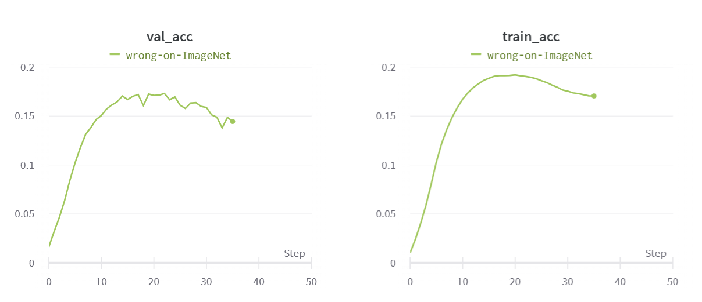
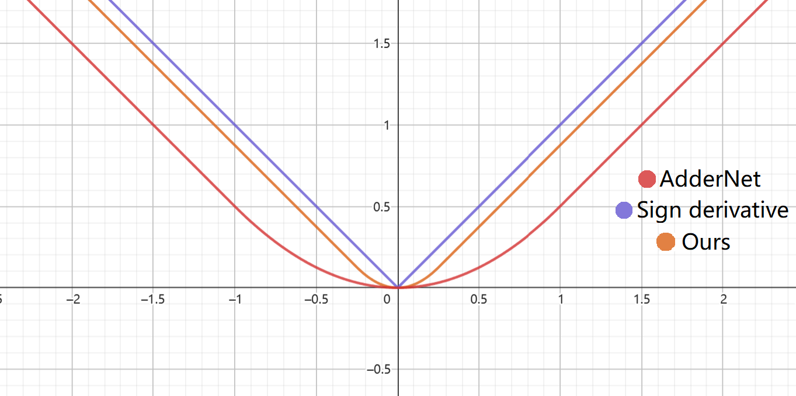
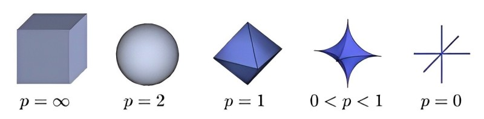
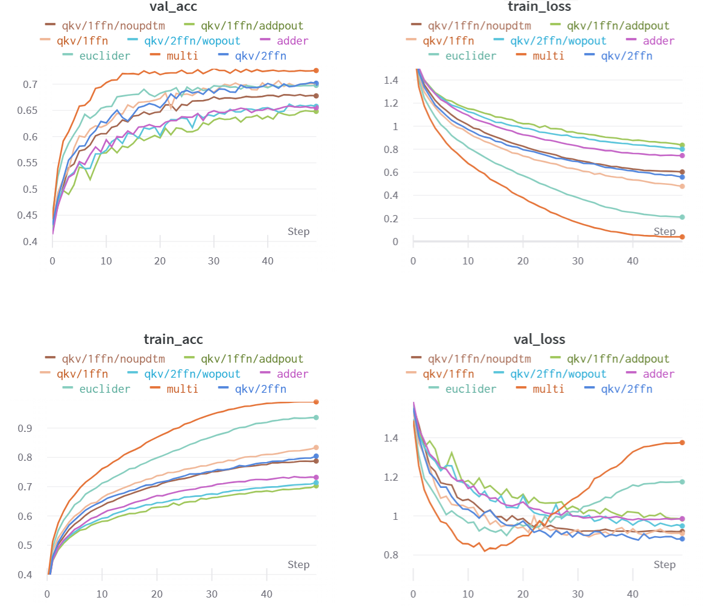
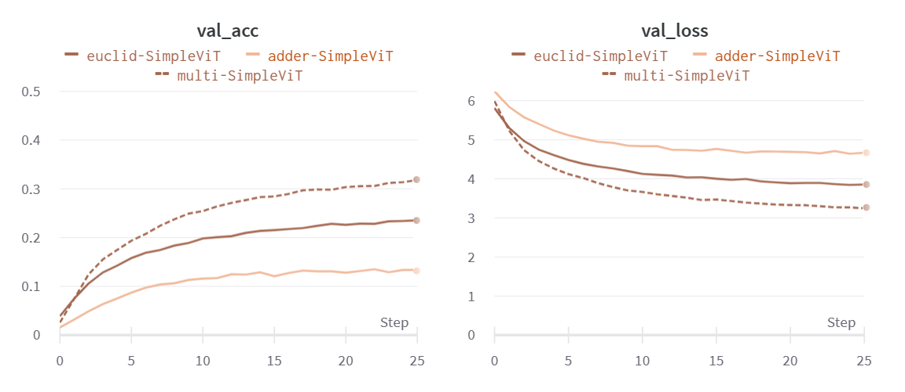
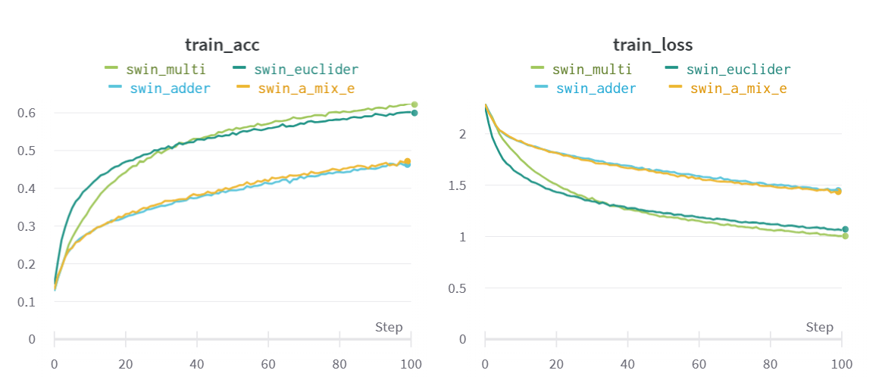
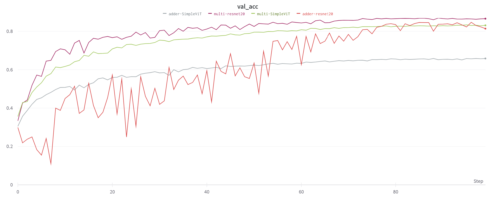

# Exploration of AdderViT

## Motivation

In recent years, the field of neural network computation has seen a significant reliance on matrix multiplication operations. However, it is worth noting that matrix multiplication is a computationally intensive operation. In this report, we explore the possibility of finding a more efficient alternative to the dot product similarity with the goal of accelerating inference in neural networks.

Since the dot product of vectors, which forms the basis of matrix multiplication, essentially calculates dot product similarity (unnormalized cosine similarity), **we have contemplated whether we could discover a more concise alternative to dot product similarity to accelerate inference.**

There are already some works that have explored similar ideas. For instance, [AdderNet](https://arxiv.org/abs/1912.13200) used $l_1$ distance to calculate the similarity between the convolution kernels and feature maps. [ShiftAddNet](https://proceedings.neurips.cc/paper/2020/file/1cf44d7975e6c86cffa70cae95b5fbb2-Paper.pdf) attempted to quantize multiplications by a factor of $\times2^n$ using a shift operation on fixed-point numbers. [EuclidNet](https://arxiv.org/abs/2212.11803) implemented the $l_2$ distance to enhance model performance.

However, all of the aforementioned methods were originally applied to CNNs. We aim to adapt these techniques to Transformer-based models.

## Adder-FC

1. Multi: $Y_{L,D_{out}}=X_{L,D_{in}}\cdot W_{D_{in},D_{out}}+b_{D_{out}}$ in which $y_{l,d}=\sum\limits_{i=1}^{D_{in}} x_{l,i} \times w_{i,d}$  
2. Adder: $Y_{L,D_{out}}=X_{L,D_{in}}\bigoplus W_{D_{in},D_{out}}+b_{D_{out}}$ in which $y_{l,d}=-\sum\limits_{i=1}^{D_{in}}| x_{l,i} - w_{i,d}|$  
3. Euclid: $Y_{L,D_{out}}=X_{L,D_{in}}\bigotimes W_{D_{in},D_{out}}+b_{D_{out}}$ in which $y_{l,d}=-\sum\limits_{i=1}^{D_{in}}( x_{l,i} - w_{i,d})^2$

### Problem 1: Back propagation on Adder

We conducted a comparison of these methods with a Simple_ViT model. Methods 1 and 3 are differentiable functions, allowing for direct application of backpropagation. However, the Adder method encountered issues with backpropagation. In line with the AdderNet approach, we mitigated this problem by substituting the sign precision gradient with the full precision gradient. (For more details, refer to [AdderNet](https://arxiv.org/abs/1912.13200).)

$$\frac{\partial y}{\partial w} = sign(x-w) \space\space\longrightarrow\space\space \frac{\partial y}{\partial w} = x-w$$

$$\frac{\partial y}{\partial x} = sign(w-x) \space\space\longrightarrow\space\space \frac{\partial y}{\partial x} = HardTanh(w-x)$$

However, we encountered a training error on large dataset, as depicted in the chart below: both training and validation accuracies declined. It is essential to note that, in accordance with the backpropagation method described earlier, the addition and multiplication operations for $W$ eventually converge to the same result. In contrast, for $X$, despite the application of gradient clipping, the forward and backward are not in alignment. This misalignment can impact the gradients that backpropagation continues to propagate, leading to incorrect updates.

We modified the backpropagation method for $X$ to align more closely with the gradient of the absolute value function. This simple $\times4$ can cause more derivative clamped, leading the full precision gradient more close to the true gradient. (The graph shows the original function corresponding to each gradient function.)

$$\frac{\partial y}{\partial x} = sign(w-x) \space\space\longrightarrow\space\space \frac{\partial y}{\partial x} = HardTanh(4\times(w-x))$$

By adopting this method, AdderViT can be trained properly on any datasets. (We also experimented with sign derivatives, but they resulted in a loss of accuracy.)

However, there is another serious problem, as the derivative of addition is associated with both $X$ and $W$, leading to increased computational demands and memory usage. Furthermore, due to poor optimization for Adder operation on CUDA, both training and inference speeds are slower than those for multiplication. (The speed can be summarized approximately as follows.)

| Methods | train time | inference time | train memory |
|:--:|:--:|:--:|:--:|
| Multi | $\times1.0$ | $\times1.0$ | $\times1.0$ |
| Adder | $OOM$ | $\times6.2$ | $OOM$ |
| optim-Adder | $\times4.1$ | $\times1.3$ | $\times1.3$ |

### Problem 2: L1-distance caused diversity loss

We thought about how radial distances (distances in each norm) behave in space. Points on the same surface will map to the same number. When $p=1$ some area in the space may be mapped to the same point, which will lead to unreasonable dimensionality reduction and loss of information.

We aim to apply a transformation to the input to stretch the shape of the distribution in space, thereby mitigating the issues mentioned above. It's worth noting that this transformation involves point-wise multiplication, but it doesn't introduce too much computation.

$$Y_{L,D}=(E_{D}\times X_{L,D})\bigoplus W_{D,D}+b_{D}$$

### Problem 3: Invalid residual connections

Residual connection is a very common operation. The basic idea is that if this layer can't learn anything useful, then let this layer be discarded and the information from the previous layer can be directly passed on without any loss of information. But in Adder operation, there will always be some information, even useless or poisonous, added into feature map. 

Residual connections are a common operation with a concept: if a layer doesn't learn anything useful, it can be skipped, and information from the previous layer can be directly passed on without any loss. However, in the Adder operation, there's always some information added to the feature map, even if it's detrimental.

The essence of this issue lies in the inability to find a suitable $W$ that enables the completion of the following identity mapping. (See [AdderSR](https://arxiv.org/abs/2009.08891) for the proof)

$$X_{L,D}=X_{L,D}\bigoplus W_{D,D}+b_{D}\space\space\space\space(Cannot\space be\space satisfied)$$

We introduced another soft-mask transformation, denoted as F, to selectively mask some of the output values. To achieve an identity mapping, one can simply set all elements in $F$ to $0\space$.

$$X_{L,D}=F_{D}\times (X_{L,D}\bigoplus W_{D,D}+b_{D})$$

### Final Methods

We utilize the following function for forward propagation:

$$X_{L,D}=F_{D}\times [(E_{D}\times X_{L,D})\bigoplus W_{D,D}+b_{D}]$$

For backpropagation, we employ the following formulas:

$$\frac{\partial y}{\partial w} = x-w$$
$$\frac{\partial y}{\partial w} = HardTanh(4\times(w-x))$$

**Unfortunately, this AdderViT is currently encountering some other unidentified issues and is not yielding satisfactory results. It's possible that the limited range of expression provided by Adder may not be sufficient to achieve a performance level comparable to multiplication in ViT models.**

## Experiments

### Simple_ViT on CIFAR10  

In this group of experiment, we used weak data augmentation, which makes the Multi overfits. Multi may actually be better than Adder if we use proper data augmentation.

``qkv``: Replace the linear transformation to_qkv with the Adder operation.  
``1ffn``: Replace 2 layers of feed-forward with 1 layer of the Adder operation.  
``2ffn``: Replace 2 layers of feed-forward with 2 layers of the Adder operation.  
``adder``: Implement the original Adder operation from AdderNet for both FFN and to_qkv.  
``multi``: The control group using the original multiplication operation.  
``noupdtm``: Excludes adaptive learning rate from AdderNet.  
``euclider``: Utilizes the $l2$-norm distance method.  
``wopout``: Attention without the project_out layer.  

### Simple_ViT on ImageNet

Due to the absence of optimization techniques tailored to Adder, the training process is considerably slow. As a result, it was trained on ImageNet for only 25 epochs, during which it exhibited a substantial performance gap, with addition performing significantly worse than multiplication.

### Swin(weakened) on CIFAR10

Across all models, Adder consistently lags behind Multi by a margin of at least $10\%$ in terms of accuracy.

### Final Results

 Due to the training challenges from the lack of optimization and some other unidentified issues, our work was regrettably compelled to come to a halt.

# Conclusion

1. The three problems mentioned above and their possible solutions.
    - Incorrect Back propagation and huge amount of computation.
    - L1-distance caused diversity loss.
    - Invalid residual connections.
2. We did a series of experiments to test some of our ideas.
    - Adder is more difficult to train than Multi and can easily lead to unstable training situations.
    - There are still some unknown obstacles to the application of addition in full connection or attention, especially for large data sets.

# Note

We leveraged the pycuda package to optimize the new addition operation, which proved to be faster than performing it directly in Python, although not significantly.

We made use of the [adder_cuda](https://github.com/LingYeAI/AdderNetCUDA) package, which is a cuda optimization of AdderNet. Please note that you may encounter installation issues with this package, so patience is advised.

We remain optimistic about the potential of the Adder operation as an alternative to traditional matrix multiplication. If you have any research insights on this topic or questions, please don't hesitate to reach out to us.
